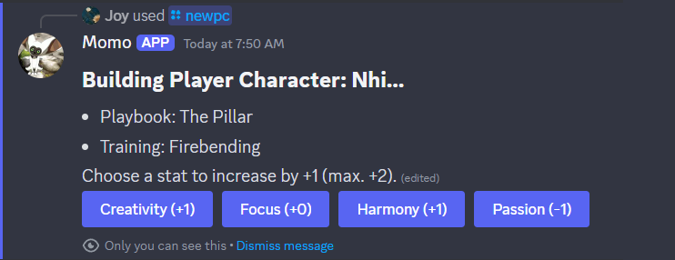

# Momo

**Momo** is a fan-made assisstive Discord bot for [_Avatar Legends: The Roleplaying Game_](https://magpiegames.com/pages/avatarrpg). He’ll track your stats and roll your dice so you can focus less on calculating modifiers and more on telling an awesome story with your friends.

## Installation

[Click here to install Momo](https://discord.com/oauth2/authorize?client_id=1279471541003878440&permissions=274877908992&integration_type=0&scope=applications.commands+bot) in your Discord server. For more detailed instructions, see the [user guide](guide/README.md).

## Features

Momo lets you:

- Create and edit player characters.
- Track fatigue, conditions, balance shifts, and center-of-balance shifts.
- Roll basic, balance, stance, and training moves.

Stat modifiers and condition penalties are automatically applied to your rolls, but can be overriden. Up to five characters are allowed per Discord account.

### Slash Commands

Momo works by listening for slash commands in servers where he’s installed. For a list of accepted commands, run `/help` or see the [user guide](guide/README.md).

### Playbooks

At this time, support for playbooks extends to balance principles and starting stats. Most playbook-specific moves and features are not yet implemented—with the exception of the Elder’s special alternate conditions.

All ten core playbooks are included; so are the playbooks from _Wan Shi Tong’s Adventure Guide_ and the _Republic City Setting Toolkit_.

## Planned Features

_Although Momo’s core functionality is great, he has a lot to learn before he’s ready to ~~save anyone~~ be a suitable replacement for a character sheet._

Features not yet supported include:

- Playbook moves
- Most playbook spceial features (except the Elder’s conditions, which are already implemented)
- Basic techniques
- Playbook advanced techniques
- Custom advanced techniques
- Statuses
- Growth and advancement
- Moments of Balance
- Creating and managing NPCs

Other fun, but not strictly necessary, planned features include:

- A searchable rules dictionary
- Image icons for player characters
- Random generators—such as for names, adventure hooks, and phaseses of the moon

## Disclaimers

Momo is fan-made, affiliated with neither Magpie Games nor the Avatar Legends franchise. His source code contains no game pieces except those which are already free and public facing. Nobody profits off Momo.
