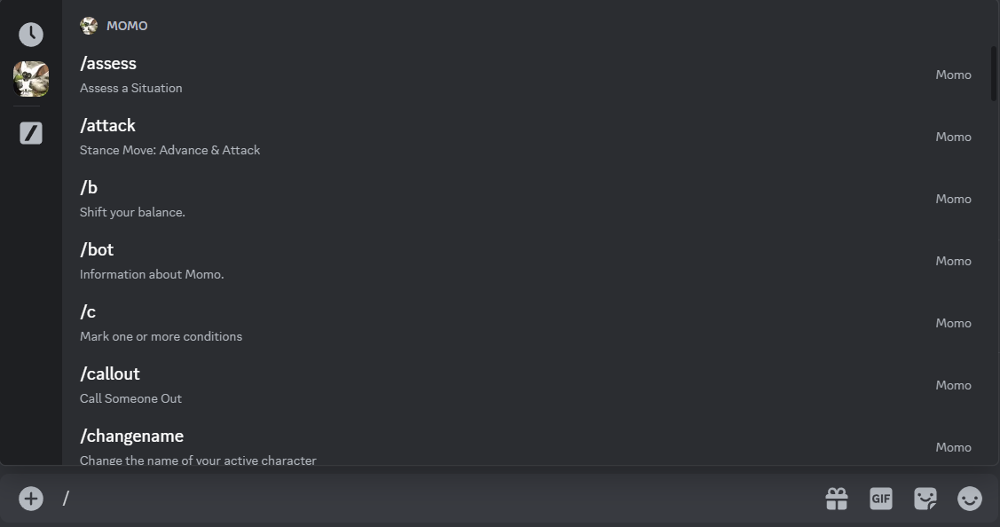

# How to Use Momo

This guide assumes that you’re familiar with the rules of [_Avatar Legends: The Roleplaying Game_](https://magpiegames.com/pages/avatarrpg). (If you're not, go check it out!)

## Installation

[Click here to install Momo.](https://discord.com/oauth2/authorize?client_id=1279471541003878440&permissions=274877908992&integration_type=0&scope=applications.commands+bot)

You'll be prompted to login to Discord if you haven't already, then see a prompt like this:

Select the server you want to install Momo on, and click "Continue". This will bring up one more comfirmation prompt:

Leave both permissions checked and click "Authorize".

And that's it!

## Slash Commands

Momo works by listening for **slash commands**; they're accessed by typing `/` and the command name into the Discord message prompt, and they look like this:

(See also [Discord's guide to slash commands](https://support.discord.com/hc/en-us/articles/1500000368501-Slash-Commands-FAQ).)

This directory contains detailed guides to each command; see the list below. Some responses are labeled ["ephemeral"](https://support.discord.com/hc/en-us/articles/1500000580222-Ephemeral-Messages-FAQ), which means that only the iniatiating user (usually, the person the who typed the slash command) can see the reply.

As an anti-spam measure, Momo's users are limited to one command per second.

### Creating & Managing Player Characters

Each Discord account may have up to five player characters. Only one of your PCs is [active](_active-pc.md) at any given time.

- [`/newpc`](newpc.md): Create a new player character.
- [`/pclist`](pclist.md): List all of your created PCs.
- [`/switchpc`](switchpc.md): Change your active PC to a different PC you’ve already created.
- [`/pcinfo`](pcinfo.md): Display all information about your active PC.
- [`/delete-pc`](delete-pc.md): Delete a player character from your account.
- [`/changestat`](changestat.md): Change your active PC’s Creativity, Harmony, Focus, or Passion.
- [`/changename`](changename.md): Change your active PC’s name.
- [`/newtraining`](newtraining.md): Add a new training to your active PC, or replace their existing training(s).

### Rolling Moves

The [move-rolling commands](_move-rolling-commands.md) work best after you create a character: they will automatically pull any relevant stats and conditions from your active PC. They still work if you have no PCs—you’ll just need to manually set your modifiers using the `extra-modifier` or `override-modifier` option.

#### Basic Moves

- `/assess`: Assess a Situation
- `/guide`: Guide and Comfort Someone
- `/intimidate`: Intimidate an NPC
- `/plead`: Plead with an NPC
- `/push`: Push Your Luck
- `/rely`: Rely on Your Skills & Training
- `/trick`: Trick an NPC

#### Balance Moves

- `/callout`: Call Someone Out
- `/deny`: Deny a Callout
- `/resist`: Resist Shifting Your Balance

#### Stance Move

- `/defend`: Defend & Maneuver
- `/attack`: Advance & Attack
- `/evade`: Evade & Observe

#### Other

- `/training`: Training Move

### Fatigue, Conditions, and Balance

- [`/condition` or `/c`](condition.md): Mark one or more conditions.
- [`/clearcondition` or `/xc`](clearcondition.md): Clear one or more conditions.
- [`/fatigue` or `/f`](fatigue.md): Mark one or more fatigue.
- [`/clearfatigue` or `/xf`](clearfatigue.md): Clear one or more fatigue.
- [`/shiftbalance` or `/b`](shiftbalance.md): Shift your balance.
- [`/returntocenter`](returntocenter.md): Set your balance to center.
- [`/shiftcenter`](shiftcenter.md): Shift your center of balance.

### Info

- [`/help`](help.md): A list of commands.
- [`/bot`](bot.md): Information about Momo.
